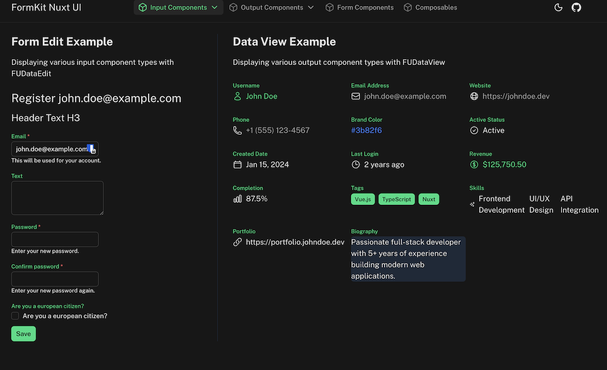

# Nuxt UI FormKit

[![npm version][npm-version-src]][npm-version-href]
[![npm downloads][npm-downloads-src]][npm-downloads-href]
[![License][license-src]][license-href]
[![Nuxt][nuxt-src]][nuxt-href]

> Seamless integration between FormKit form handling and Nuxt UI components for Nuxt 4

FormKit Nuxt UI bridges the gap between [FormKit](https://formkit.com/)'s powerful form management and [Nuxt UI](https://ui.nuxt.com/)'s beautiful component library, providing a complete solution for building forms in Nuxt applications.

- [✨ &nbsp;Release Notes](/CHANGELOG.md)
- [🏀 &nbsp;Live Playground](https://github.com/sfxcode/nuxt-ui-formkit/tree/main/playground)
- [📖 &nbsp;FormKit Documentation](https://formkit.com/)
- [🎨 &nbsp;Nuxt UI Documentation](https://ui.nuxt.com/)



## Features

✨ **20 Input Components** - Complete set of FormKit-wrapped Nuxt UI input components
- `nuxtUICalendar` - Bare date-grid picker with range/multiple selection
- `nuxtUICheckbox` - Single checkbox with label and description
- `nuxtUICheckboxGroup` - Multiple checkbox selection
- `nuxtUIColorPicker` - Color selection with multiple formats
- `nuxtUIEditor` - Tiptap-based rich text editor
- `nuxtUIFileUpload` - Drag/drop and click-to-browse file input
- `nuxtUIInput` - Text input with various types (text, email, password, etc.)
- `nuxtUIInputDate` - Date and time picker with range support
- `nuxtUIInputMenu` - Dropdown menu with searchable options
- `nuxtUIInputNumber` - Number input with increment/decrement buttons
- `nuxtUIInputTags` - Tag input with custom delimiters
- `nuxtUIInputTime` - Time picker with 12/24-hour format
- `nuxtUIListbox` - Listbox for single/multiple selection with filtering (for use with transfer mode lucide icons must be installed additionally)
- `nuxtUIPinInput` - PIN/OTP entry component
- `nuxtUIRadioGroup` - Radio button group for single selection
- `nuxtUISelect` - Select dropdown with search
- `nuxtUISelectMenu` - Advanced select with grouping
- `nuxtUISlider` - Range slider for numeric values
- `nuxtUISwitch` - Toggle switch for boolean states
- `nuxtUITextarea` - Multi-line text input with autoresize

🔁 **Repeater Component** - Dynamic repeatable form sections
- `nuxtUIRepeater` - Create dynamic lists with add, remove, clone, and reorder functionality

🧭 **Multi-Step Forms** - Wizard-style forms with tab navigation and validation gating
- `nuxtUIMultiStep` - Tab-strip wizard container built on `@formkit/addons`' `createMultiStepPlugin`
- `nuxtUIStep` - A single step's content, with Nuxt UI-styled previous/next actions

📊 **6 Output Components** - Display-only components for read-only data
- `nuxtUIOutputBoolean` - Boolean display with custom icons
- `nuxtUIOutputDate` - Formatted date/time display
- `nuxtUIOutputLink` - URL display with navigation
- `nuxtUIOutputList` - List display with separators and badge styles
- `nuxtUIOutputNumber` - Formatted number display (currency, percentage)
- `nuxtUIOutputText` - Styled text display with icons

🎯 **Form Management** - Powerful form utilities
- `FUDataEdit` - Edit forms with schema-based configuration
- `FUDataView` - Read-only data display with schema support
- `FUDataDebug` - Development tool for form debugging
- `FUAutoForm` - Schema-free forms: inputs inferred from your data's value shapes, or a Valibot/Zod schema, with an override map for fine-tuning

⚙️ **Config Helper** - One-line `formkit.config.ts` setup
- `createNuxtUiFormkitConfig` - Assembles all `nuxtUIXxx` inputs/outputs and this module's plugins into `{ inputs, plugins }` you spread into your own config

🔧 **Composables & Utilities** - Reusable form logic
- `useFormKitSchema` - Schema-based form generation with element builders
- `useFormKitInput` - Input component utilities and prop handling
- `useFormKitOutput` - Output component utilities and prop handling
- `useFormKitRepeater` - Repeater insert/remove/clone/move/drag handlers
- `useFormKitMultiStep` - Multi-step tab-item mapping and navigation bridging
- `useFormKitForm` - Submit/reset/error-management wrapper for a form's imperative APIs, callable from outside the form
- `useFormKitAutoForm` - Schema inference from data value shapes, Valibot, or Zod schemas (`inferFormSchema`/`inferFormSchemaFromValibot`/`inferFormSchemaFromZod`)
- `colorConverter` - Color format conversion utilities
- `durationConverter` - Duration format conversion utilities

🎨 **Full Nuxt UI Integration** - All components respect Nuxt UI theming
- Color modes (light/dark)
- Design tokens
- Accessibility features
- Responsive design

✅ **TypeScript Support** - Full type safety with IntelliSense
⚡ **SSR Compatible** - Works seamlessly with Nuxt's server-side rendering
🔄 **Auto-imports** - Components and composables auto-imported
📝 **Validation** - Built-in FormKit validation support

## Quick Setup

Install the module to your Nuxt application:

```bash
# Using pnpm (recommended)
pnpm add @sfxcode/nuxt-ui-formkit

# Using npm
npm install @sfxcode/nuxt-ui-formkit

# Using yarn
yarn add @sfxcode/nuxt-ui-formkit
```

Add the module to your `nuxt.config.ts`:

```typescript
export default defineNuxtConfig({
  modules: [
    '@nuxt/ui',
    '@sfxcode/nuxt-ui-formkit'
  ]
})
```

That's it! You can now use FormKit Nuxt UI components in your Nuxt app ✨

## Usage

### Basic Form Example

```vue
<template>
  <FormKit
    type="form"
    @submit="handleSubmit"
  >
    <FormKit
      type="nuxtUIInput"
      name="email"
      label="Email Address"
      placeholder="your.email@example.com"
      validation="required|email"
    />

    <FormKit
      type="nuxtUIInput"
      name="password"
      input-type="password"
      label="Password"
      validation="required|length:8"
    />

    <FormKit
      type="nuxtUICheckbox"
      name="terms"
      label="I agree to the terms and conditions"
      validation="accepted"
    />

    <UButton type="submit">
      Sign Up
    </UButton>
  </FormKit>
</template>

<script setup lang="ts">
const handleSubmit = (data: any) => {
  console.log('Form submitted:', data)
}
</script>
```

### Schema-Based Form

```vue
<template>
  <FUDataEdit
    :data="formData"
    :schema="userSchema"
    @submit="handleSubmit"
  />
</template>

<script setup lang="ts">
const formData = ref({
  name: '',
  email: '',
  age: 0,
  subscribe: false
})

const userSchema = [
  {
    $formkit: 'nuxtUIInput',
    name: 'name',
    label: 'Full Name',
    validation: 'required'
  },
  {
    $formkit: 'nuxtUIInput',
    name: 'email',
    inputType: 'email',
    label: 'Email',
    validation: 'required|email'
  },
  {
    $formkit: 'nuxtUIInputNumber',
    name: 'age',
    label: 'Age',
    min: 0,
    max: 120
  },
  {
    $formkit: 'nuxtUISwitch',
    name: 'subscribe',
    label: 'Subscribe to newsletter'
  }
]

const handleSubmit = (data: any) => {
  console.log('Form submitted:', data)
}
</script>
```

### Advanced Number Input with Formatting

```vue
<FormKit
  type="nuxtUIInputNumber"
  name="price"
  label="Product Price"
  :min="0"
  :step="0.01"
  :format-options="{
    style: 'currency',
    currency: 'USD'
  }"
  validation="required|min:0"
/>
```

### Output Components for Display

```vue
<template>
  <FUDataView
    :data="userData"
    :schema="displaySchema"
  />
</template>

<script setup lang="ts">
const userData = ref({
  name: 'John Doe',
  email: 'john@example.com',
  price: 1234.56,
  tags: ['Vue', 'Nuxt', 'TypeScript'],
  isActive: true
})

const displaySchema = [
  {
    $formkit: 'nuxtUIOutputText',
    name: 'name',
    label: 'Name',
    leadingIcon: 'i-heroicons-user'
  },
  {
    $formkit: 'nuxtUIOutputLink',
    name: 'email',
    label: 'Email',
    leadingIcon: 'i-heroicons-envelope'
  },
  {
    $formkit: 'nuxtUIOutputNumber',
    name: 'price',
    label: 'Price',
    formatOptions: {
      style: 'currency',
      currency: 'USD'
    }
  },
  {
    $formkit: 'nuxtUIOutputList',
    name: 'tags',
    label: 'Technologies',
    listType: 'badge',
    color: 'primary'
  },
  {
    $formkit: 'nuxtUIOutputBoolean',
    name: 'isActive',
    label: 'Status',
    trueValue: 'Active',
    falseValue: 'Inactive'
  }
]
</script>
```

## Component Props

All components support their respective Nuxt UI component props plus FormKit-specific props like `name`, `label`, `help`, `validation`, etc.

Refer to the [Nuxt UI documentation](https://ui.nuxt.com/) for component-specific props and the [FormKit documentation](https://formkit.com/) for validation and form handling.

## Examples

The playground includes comprehensive examples for all components:

### Input Components
- [Calendar](./playground/app/pages/components/input/calendar.vue)
- [Checkbox](./playground/app/pages/components/input/checkbox.vue)
- [CheckboxGroup](./playground/app/pages/components/input/checkbox-group.vue)
- [ColorPicker](./playground/app/pages/components/input/color-picker.vue)
- [Editor](./playground/app/pages/components/input/editor.vue)
- [FileUpload](./playground/app/pages/components/input/file-upload.vue)
- [Input](./playground/app/pages/components/input/input.vue)
- [InputDate](./playground/app/pages/components/input/input-date.vue)
- [InputMenu](./playground/app/pages/components/input/input-menu.vue)
- [InputNumber](./playground/app/pages/components/input/input-number.vue)
- [InputTags](./playground/app/pages/components/input/input-tags.vue)
- [InputTime](./playground/app/pages/components/input/input-time.vue)
- [Listbox](./playground/app/pages/components/input/listbox.vue)
- [PinInput](./playground/app/pages/components/input/pin-input.vue)
- [RadioGroup](./playground/app/pages/components/input/radio-group.vue)
- [Select](./playground/app/pages/components/input/select.vue)
- [SelectMenu](./playground/app/pages/components/input/select-menu.vue)
- [Slider](./playground/app/pages/components/input/slider.vue)
- [Switch](./playground/app/pages/components/input/switch.vue)
- [Textarea](./playground/app/pages/components/input/textarea.vue)

### Output Components
- [OutputBoolean](./playground/app/pages/components/output/boolean.vue)
- [OutputDate](./playground/app/pages/components/output/date.vue)
- [OutputLink](./playground/app/pages/components/output/link.vue)
- [OutputList](./playground/app/pages/components/output/list.vue)
- [OutputNumber](./playground/app/pages/components/output/number.vue)
- [OutputText](./playground/app/pages/components/output/text.vue)

### Repeater
- [Repeater](./playground/app/pages/form/repeater-sample.vue)
- [Drag-and-Drop Repeater](./playground/app/pages/form/repeater-drag.vue)

### Multi-Step
- [Multi-Step Form](./playground/app/pages/form/multi-step.vue)

### Form Composable
- [useFormKitForm](./playground/app/pages/form/form-composable.vue)

## Development

<details>
  <summary>Local development setup</summary>
  
  ```bash
  # Clone the repository
  git clone https://github.com/sfxcode/nuxt-ui-formkit.git
  cd nuxt-ui-formkit
  
  # Install dependencies (using pnpm)
  pnpm install
  
  # Generate type stubs
  pnpm dev:prepare
  
  # Start development server with playground
  pnpm dev
  
  # Build the playground
  pnpm dev:build
  
  # Run ESLint
  pnpm lint
  
  # Run tests
  pnpm test
  pnpm test:watch
  
  # Build the module
  pnpm build
  
  # Release new version
  pnpm release
  ```

</details>

## Requirements

- Nuxt 4.x
- Vue 3.x
- @nuxt/ui 4.3.0+
- @formkit/vue 1.x
- @formkit/nuxt 1.x

## External Module Usage

External Nuxt modules and applications can import FormKit definitions programmatically.

### Import All Definitions

```typescript
import { nuxtUIInputs, nuxtUIOutputs } from '@sfxcode/nuxt-ui-formkit/formkit'

// Use in FormKit config
export default defineFormKitConfig({
  inputs: {
    ...nuxtUIInputs,
    ...nuxtUIOutputs,
  },
})
```

### Import Individual Definitions

```typescript
import { 
  nuxtUICheckboxDefinition,
  nuxtUIInputDefinition,
  nuxtUIListboxDefinition,
  nuxtUISelectDefinition 
} from '@sfxcode/nuxt-ui-formkit/definitions'

export default defineFormKitConfig({
  inputs: {
    nuxtUICheckbox: nuxtUICheckboxDefinition,
    nuxtUIInput: nuxtUIInputDefinition,
    nuxtUIListbox: nuxtUIListboxDefinition,
    nuxtUISelect: nuxtUISelectDefinition,
  },
})
```

### Available Import Paths

- `@sfxcode/nuxt-ui-formkit/formkit` - All definitions + type augmentation
- `@sfxcode/nuxt-ui-formkit/definitions` - Definition objects only

For detailed usage examples, see [EXTERNAL_USAGE.md](./EXTERNAL_USAGE.md).

## Contributing

Contributions are welcome! Please feel free to submit a Pull Request.

1. Fork the repository
2. Create your feature branch (`git checkout -b feature/amazing-feature`)
3. Commit your changes using [Conventional Commits](https://www.conventionalcommits.org/) (`git commit -m 'feat: add amazing feature'`)
4. Push to the branch (`git push origin feature/amazing-feature`)
5. Open a Pull Request

## License

[MIT License](./LICENSE) © 2024-present [sfxcode](https://github.com/sfxcode)

## Credits

- [FormKit](https://formkit.com/) - Form framework for Vue
- [Nuxt UI](https://ui.nuxt.com/) - UI library for Nuxt
- [Nuxt](https://nuxt.com/) - The Intuitive Vue Framework

<!-- Badges -->
[npm-version-src]: https://img.shields.io/npm/v/@sfxcode/nuxt-ui-formkit/latest.svg?style=flat&colorA=020420&colorB=00DC82
[npm-version-href]: https://npmjs.com/package/@sfxcode/nuxt-ui-formkit

[npm-downloads-src]: https://img.shields.io/npm/dm/@sfxcode/nuxt-ui-formkit.svg?style=flat&colorA=020420&colorB=00DC82
[npm-downloads-href]: https://npm.chart.dev/@sfxcode/nuxt-ui-formkit

[license-src]: https://img.shields.io/npm/l/@sfxcode/nuxt-ui-formkit.svg?style=flat&colorA=020420&colorB=00DC82
[license-href]: https://npmjs.com/package/@sfxcode/nuxt-ui-formkit

[nuxt-src]: https://img.shields.io/badge/Nuxt-020420?logo=nuxt
[nuxt-href]: https://nuxt.com
